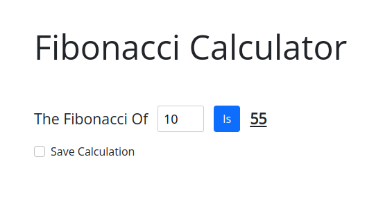

# Fibonacci Calculator Web Page

Welcome to the Fibonacci Calculator web page! This simple web application allows you to calculate Fibonacci numbers with ease.

## Table of Contents

- [Getting Started](#getting-started)
  - [Prerequisites](#prerequisites)
  - [Installation](#installation)
- [Usage](#usage)
- [Contributing](#contributing)
- [License](#license)

## Getting Started

### Prerequisites

Before you can use this Fibonacci Calculator, you need the following:

- A modern web browser (e.g., Chrome, Firefox, Safari)
- An internet connection

### Installation

You don't need to install anything to use this web page. Simply open your web browser and navigate to the URL where the Fibonacci Calculator is hosted.

## Usage

1. Open your web browser.
2. Enter the URL of the Fibonacci Calculator web page.
3. You will see an input field labeled "The Fibonacci Of"
4. Type in the number for which you want to calculate the Fibonacci sequence.
5. Click the "Calculate" button.
6. The Fibonacci sequence for the entered number will be displayed below the input field.

Example:
- Input: 6
- Output: 8

Feel free to experiment with different numbers to see the Fibonacci sequence for various inputs!

## Contributing

If you would like to contribute to this project, please follow these steps:

1. Fork the repository.
2. Create a new branch for your feature or bug fix: `git checkout -b feature/new-feature` or `git checkout -b bugfix/fix-issue`.
3. Make your changes and commit them: `git commit -m 'Add new feature'`.
4. Push your changes to your fork: `git push origin feature/new-feature`.
5. Create a pull request to the main repository.

## License

This project is licensed under the MIT License 
